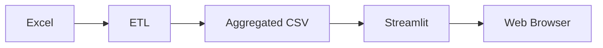
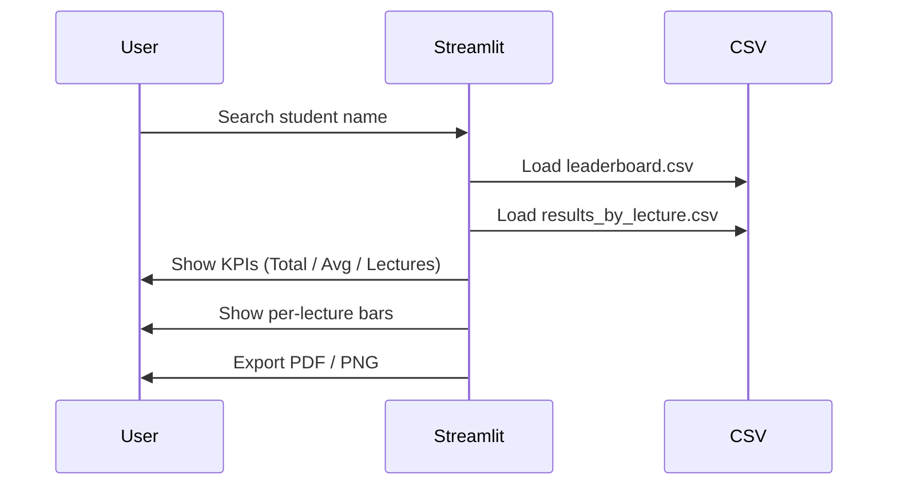

# 🏆 PyLab Homework Leaderboard

A professional **ETL + Streamlit analytics dashboard** for visualizing student homework results.

The project processes raw Excel homework files, transforms them into clean aggregated datasets, and presents rankings, student profiles, per-lecture progress bars, and downloadable PDF/PNG reports.

---

## 🚀 Features

- 📊 Dynamic leaderboard with KPIs
- 🔍 Student search with detailed profile
- 📈 Per-lecture progress bars (visual, solid)
- 📥 Student profile export to **PDF** and **PNG**
- 🔁 Ready for automated ETL pipelines
- ☁️ Streamlit Cloud deployment

---

## 🧱 Project Structure

```
PyLab-Homework-Leaderboard/
│
├── app/
│   └── app_csv.py              # Streamlit application
│
├── etl/
│   ├── extract.py              # XLSX → CSV
│   └── transform.py            # Cleaning, aggregation, leaderboard
│
├── input/
│   └── *.xlsx                  # Raw Excel homework files (PUT HERE)
│
├── output/
│   ├── leaderboard.csv         # Final leaderboard (auto-generated)
│   └── results_by_lecture.csv  # Per-lecture scores (optional but recommended)
│
├── assets/
│   ├── python.png              # Python logo
│   └── trophy.png              # Trophy icon
│
├── requirements.txt
└── README.md
```

---

## ⚙️ How to Run Locally

### 1️⃣ Clone repository
```bash
git clone https://github.com/amuzarau/PyLab-Homework-Leaderboard.git
cd PyLab-Homework-Leaderboard
```

### 2️⃣ Create virtual environment
```bash
python -m venv .venv
source .venv/bin/activate   # Linux / macOS
.venv\Scripts\activate      # Windows
```

### 3️⃣ Install dependencies
```bash
pip install -r requirements.txt
```

### 4️⃣ Add Excel files
Place your homework Excel files here:
```
input/*.xlsx
```

### 5️⃣ Run ETL pipeline
```bash
python etl/extract.py
python etl/transform.py
```

After this step, **two result files will appear**:
```
output/leaderboard.csv
output/results_by_lecture.csv
```

### 6️⃣ Run Streamlit app
```bash
streamlit run app/app_csv.py
```

---

## 📊 ETL Flow Diagram

```mermaid
flowchart TD
    A[Excel files (.xlsx)] --> B[extract.py]
    B --> C[CSV files]
    C --> D[transform.py]
    D --> E[leaderboard.csv]
    D --> F[results_by_lecture.csv]
```

---

## 🧠 Application Architecture



---

## 👤 Student Profile Logic



---

## ☁️ Deployment (Streamlit Cloud)

1. Push project to GitHub
2. Go to **https://streamlit.io/cloud**
3. Create new app
4. Select repository and `app/app_csv.py`
5. Streamlit Cloud auto-deploys on every push

---

## 🔮 Future Improvements

### 🔄 Full Pipeline Automation (Apache Airflow)

```mermaid
flowchart TD
    A[New Excel files] --> B[Airflow DAG]
    B --> C[extract.py<br/>(xlsx → csv)]
    C --> D[transform.py<br/>(cleaning, aggregation)]
    D --> E[output/*.csv]
    E --> F[GitHub push]
    F --> G[Streamlit Cloud auto-redeploy]
```

**How it works:**
- Airflow watches `input/` for new Excel files
- Automatically runs ETL scripts
- Pushes updated CSVs to GitHub
- Streamlit Cloud redeploys app automatically

---

### 🐳 Database Backend (Docker Compose)

Planned enhancement:
- PostgreSQL or MySQL as backend
- Docker Compose orchestration
- Streamlit reads from DB instead of CSV
- Enables scalability and historical analytics

---

## 🛠 Tech Stack

- **Python**
- **Pandas**
- **Streamlit**
- **Plotly**
- **Pillow (PIL)**
- **ReportLab**
- **Mermaid**
- **Docker / Docker Compose (planned)**
- **Apache Airflow (planned)**

---


